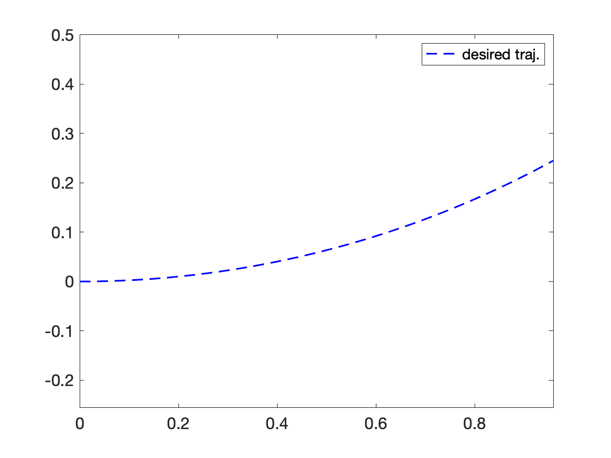
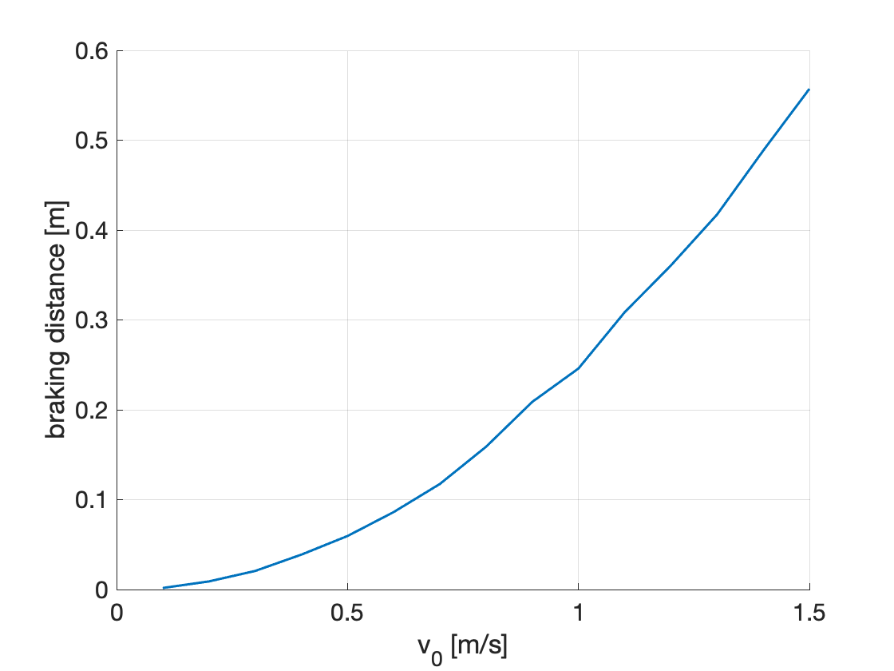
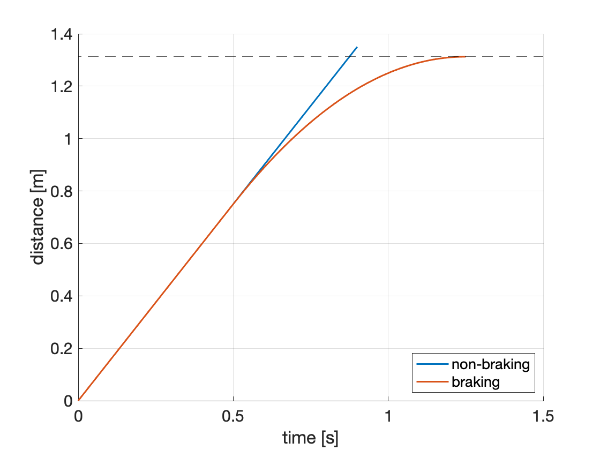

**TL;DR**: Run `example_3_braking_trajectory.m`. The other examples are pretty straightforward too.

# Step 1: Picking a Trajectory-Producing Model

#### [Previous: tutorial summary](https://github.com/skousik/RTD_tutorial)

For the purposes of RTD, we refer a robot's state space model as a **high-fidelity model**, because we expect it to accurately describe the robot's motion. Recall that the Turtlebot's high-fidelity model has four states and two control inputs. So, including time, this model has seven **dimensions**. But, generating *correct* trajectories for systems with this many dimensions is often too slow for online planning. To avoid this issue, we use a **trajectory-producing model** that has fewer dimensions, but can still produce **desired trajectories** for the high-fidelity model to track.


## Summary

In this step, we pick the trajectory-producing model. The goal is to reduce the number of dimensions as much as possible while still producing trajectories that the robot can track closely. In addition, remember that our definition of correct for the TurtleBot means that we care about avoiding obstacles (which exist in $x$ and $y$, but not in the robot's other states). So, our ideal trajectory-producing model should only have position as its states.

In this part, we'll discuss the following:

1. The **Dubins' car** kinematic model, which has 3 states and 2 inputs
2. **Parameterized trajectories**, which allow us simplify how we think about control inputs
3. Trajectory **tracking**, where we notice that the Turtlebot can't track parameterized trajectories perfectly
4. The **fail-safe maneuver**, where we specify that every planned trajectory ends with braking
5. The **planning time horizon**, where we make sure our planned trajectories are long enough to include braking to a stop

With these 5 things in place, we will have a dynamic model that produces smooth trajectories that include braking. In the following sections, we'll take a deeper dive into the tracking error, then use the tracking error and desired trajectories for reachability analysis, and finally perform online planning.


## 1.1 Dubins' Car

Recall that we use a unicycle model for the TurtleBot. If we get rid of the speed dimension, and replace acceleration with speed as our second control input, we end up with a model called a **Dubins' car**:
$$
\begin{align}
\frac{d}{dt}\begin{bmatrix}x \\ y \\ \theta \end{bmatrix} = \begin{bmatrix} v\cos\theta \\ v \sin\theta \\ \omega \end{bmatrix}.
\end{align}
$$


Note that $\theta$ is written as `h` in the code (for "heading"). We pick this as our trajectory-producing model because it's very similar to our high-fidelity model, but lower-dimensional, and because it can create meaningful and diverse paths for the TurtleBot to track in arbitrary environments.


## 1.2 Trajectory Parameters

Note that the control inputs can vary with time and the robot's states. In the case of the high-fidelity mode, this lets the robot track a desired trajectory using closed-loop feedback. But, if the trajectory-producing model can have any combination of speed and yaw rate at any time, the set of all possible desired trajectories is really big - and this can make computing the FRS tricky.

So, we want to reduce the "size" of the control input space for the trajectory-producing model. We do this by introducing **trajectory parameters**, which is why we say that RTD uses *parameterized* trajectories. We denote these parameters by $k = (k_1,k_2)$, which give us desired yaw rate and speed, respectively. Then, we rewrite our Dubins' car model as follows:
$$
\begin{align}
\frac{d}{dt}\begin{bmatrix}x \\ y \\ \theta \\ k \end{bmatrix} = \begin{bmatrix} k_2 \cos\theta \\ k_2 \sin\theta \\ k_1 \\ 0 \end{bmatrix},
\end{align}
$$


Notice that the parameters are fixed (since their time derivative is 0). Of course, it doesn't make sense for them to be fixed for _all time_, since the robot probably won't do anything useful if its speed and yaw rate are fixed forever. Instead, we fix the control parameters over the finite planning time horizon of duration $t_{\mathrm{f}}$.

### Example 1

To understand how these trajectories look, let's create a desired trajectory with $\omega = 0.5$ rad/s and $v = 1.0$ m/s, starting from the initial state $(x,y,\theta) = (0,0,0)$. Run the following code in the MATLAB command window:

```matlab
t_f = 1 ;
w_des = 0.5 ; % rad/s
v_des = 1.0 ; % m/s
[T,U,Z] = make_turtlebot_desired_trajectory(t_f,w_des,v_des) ;
```

The desired trajectory is specified as a time array `T` (1-by-N), an input vector `U` (2-by-N), and the desired trajectory `Z` (4-by-N). We can look at this trajectory with the following code:

```
% get the x and y positions of the trajectory
x = Z(1,:) ;
y = Z(2,:) ;

% plot
figure(1) ;
plot(x,y,'b--','LineWidth',1.5)
axis equal
```

You should see something like this:



This code is in `step_1_ex_1_desired_trajectory.m` as well.


## 1.3 Tracking Desired Trajectories

Now, we can try tracking this desired trajectory! The following code is in `step_1_ex_2_trajectory_tracking.m`.

### Example 2

First, let's create a TurtleBot:

```matlab
A = turtlebot_agent() ;
```


Note that this requires you to have the [simulator](github.com/skousik/simulator) repository on your MATLAB path. To use this 
"agent" representation of the TurtleBot, first give it an initial condition of $(x,y,\theta,v) = (0,0,0,0.5)$:

```matlab
A.reset([0;0;0;0.5])
```

We can also take a look at the robot:

```
figure(1) ; clf ; axis equal ;
plot(A)
```

The robot has a circular **footprint**, and its heading is indicated by a dark arrow. It can track a desired trajectory by using its `move` method. First, create a desired trajectory:

```
t_f = 1 ;
w_des = 0.5 ; % rad/s
v_des = 1.0 ; % m/s
[T,U,Z] = make_turtlebot_desired_trajectory(t_f,w_des,v_des) ;

% plot
hold on
plot(Z(1,:),Z(2,:),'b--','LineWidth',1.5)
```

Now, move the agent:

```
t_total = 0.75 ;
A.move(t_total,T,U,Z)
```

To see it in action, let's animate it:

```
A.animate()
```

You should see something like this once the animation completes:


Notice that the robot did not perfectly track the desired trajectory. This is because its initial speed is different from its desired speed. Note that the agent uses a low-level controller for trajectory tracking that is explained a bit more below, in [Appendix 1.B](https://github.com/skousik/RTD_tutorial/tree/master/step_1_desired_trajectories#appendix-1b-low-level-controller).


## 1.4 Fail-Safe Maneuver

There is one key thing still missing. In every desired trajectory, we also need to include a **fail-safe maneuver**, which brings the robot to a known correct state. For the Turtlebot, staying stationary is always correct, since we only care about static obstacles. So, our fail-safe maneuver is braking to a stop. In particular, we must encode braking to a stop in our desired trajectory for the time interval $[t_{\mathrm{plan}}, t_{\mathrm{f}}]$, as noted in the tutorial intro.

To create the braking maneuver, we first need to understand the braking performance of the Turtlebot.Recall that the Turtlebot, according to our high-fidelity model, has a maximum longitudinal acceleration of -2 m/s$^2$. Since acceleration is a control input, we assume that we can apply any acceleration at any time, which is fine since we are just dealing with a math model and not a real robot for now. Therefore, we can generate a braking trajectory by specifying a linear decrease (at the rate of -2 m/s$^2$) in our speed state from $t_{\mathrm{plan}}$ until the speed is 0.

### Example 3

To see what braking looks like, let's create a braking trajectory. This code is all in `step_1_ex_3_braking_trajectory.m`. First, set up some variables:

```matlab
% desired trajectory
v_des = 1 ; % m/s
w_des = 1 ; % rad/s

% timing
t_plan = 0.5 ; % m/s

```

Now, let's compute how long it will take to stop from our desired speed:

```matlab
A = turtlebot_agent() ;
t_stop = v_des / A.max_accel ;
```

We can use `t_stop` to compute a desired trajectory with braking:

```matlab
[T_brk,U_brk,Z_brk] = make_turtlebot_braking_trajectory(t_plan,t_stop,w_des,v_des) ;
```

If we plot this trajectory in each of the states, we can see how the speed linearly decreases to zero:


## 1.5 Time Horizon

With our braking maneuver in hand, we can now decide on the time horizon $t_{\mathrm{f}}$ needed for our reachability analysis (Step 3 of the RTD tutorial).

Recall that we are only considering static obstacles for now, so our reachable set does not need to include time (see [this paper](http://www.roboticsproceedings.org/rss15/p51.pdf) for how to deal with dynamic obstacles). Furthermore, we'll do a simple version of the reachability analysis, where we do not include the braking **explicitly** in the desired trajectory. Instead, we will compute our reachable set as though the yaw rate and speed are fixed for the time horizon $T = [0, t_{\mathrm{f}}]$.

This means we need to include the braking **implicitly** -- so, the time horizon needs to be long enough that the desired trajectory model travels _farther_ without braking than it would _with_ braking.

To understand how long to make the time horizon, let's first look at how the braking distance increases as a function of the initial speed. Run the script `step_1_inspect_braking_distance_vs_initial_speed.m` in `step_1_desired_trajectories/scripts/`, and you'll see the following plot:



The braking distance increases roughly quadratically with the initial speed. This means that we can pick $t_{\mathrm{f}}$ as $t_{\mathrm{plan}}$ plus the largest value of $d_{\mathrm{brk}} / v_0$, i.e., the braking distance divided by the initial speed (see Equation (91) in Appendix 12 of [this paper](https://arxiv.org/pdf/1809.06746.pdf)).

In the code, we can do this (after running the script mentioned above) as follows:

```matlab
t_f_candidates = d_brk ./ v_0_vec ;
t_f = t_plan + max(t_f_candidates) ;
```

It turns out that $t_{\mathrm{f}} = 0.5 + 0.4 = 0.9$ s, for the particular Turtlebot dynamics that we have, given the max speed of 1.5 m/s. Note that we've rounded up to the nearest 0.1 s to preempt numerical errors.

This is kind of confusing to think about, so we summarize it again here. Suppose that we forward-integrate the trajectory producing model _without braking_ for the duration $t_{\mathrm{f}} = 0.9$ s, with $v = 1.5$ m/s. Then, the total distance traveled is _greater_ than the distance traveled by the same dynamics if they braked to a stop, beginning at $t_{\mathrm{plan}} = 0.5$ s.

We can check this claim numerically, with the script `step_1_validate_t_f.m`.

```matlab
% set up speed and yaw rate
v_max = 1.5 ; % m/s
w_des = 0.0 ; % rad/s

% set up timing
t_plan = 0.5; % s

% create turtlebot
A = turtlebot_agent() ;

% create non-braking trajectory
t_f = t_plan + 0.4 ;
[T_go,~,Z_go] = make_turtlebot_desired_trajectory(t_f,w_des,v_max) ;

% create braking trajectory
t_stop = v_max / A.max_accel ;
[T_brk,~,Z_brk] = make_turtlebot_braking_trajectory(t_plan,t_stop,w_des,v_max) ;
```

Plotting the relevant values, we see that the non-braking trajectory travels farther than the braking trajectory:




Now that we have the robot tracking desired trajectories and braking, we can move on to computing a **tracking error function**.

#### [Next: computing tracking error](https://github.com/skousik/RTD_tutorial/tree/master/step_2_error_function)


## Appendix 1.A: Rigid Body Dynamics

Most robots aren't just point masses. However, the dynamics we write for them, and the desired trajectories we create, are often defined for point masses. To make a point mass trajectory feasible for a robot with a **body** (which has nonzero volume), we then need to use tricks like dilating (i.e., expanding or buffering) obstacles before we plan the trajectory.

With RTD, we get around this issue by representing the motion of the robot's entire body in the desired trajectory. Suppose that $x, y: [0,t_f] \to \mathbb{R}$ are differentiable trajectories of the robot's center of mass, and $\theta: [0,t_f] \to \mathbb{R}$ is a differentiable trajectory of the robot's heading. Then, assuming the robot is a rigid body, we can describe the motion of any point $(x',y')$ on the robot's body with the following differential equation:
$$
\begin{align}
\frac{d}{dt}\begin{bmatrix} x'(t) \\ y'(t) \end{bmatrix} = \begin{bmatrix} \dot{x}(t) - \dot{\theta}(t)\cdot(y(t) - y'(t)) \\ \dot{y}(t) + \dot{\theta}(t)\cdot(x(t) - x'(t)) \end{bmatrix}
\end{align}.
$$


Ideally, we would want to write down the dynamics of _every_ point on the robot's body this way, but, since you can think of a robot's body as a set in Euclidean space, its body typically contains an infinite number of points. This means we would need an infinite number of differential equations to describe the motion of its entire body.


However, in our [reachability analysis (Step 3)](https://github.com/skousik/RTD_tutorial/tree/master/step_3_FRS_computation), we are able to compute the motion of every point on the robot's body by rewriting the Dubins' car in the following way. First, suppose that, at $t = 0$, the robot's center of mass is at $(x_0, y_0)$, and the robot's initial heading is $\theta_0 = 0$. Then, the following differential equation will produce the trajectory of any point $(x',y')$ on the body:
$$
\begin{align}
\frac{d}{dt}\begin{bmatrix} x' \\ y' \end{bmatrix} = \begin{bmatrix} v - \omega\cdot(y - y_0) \\ \omega\cdot(x - x_0) \end{bmatrix}.
\end{align}
$$


This trick works because this differential equation describes a circular flow field about the rigid body's center of rotation, where the body is rotating at the (constant) rate $\omega$ and the center of mass is initially traveling at the speed $v$ in the positive $x$ direction.

Since the position and heading of the robot can be treated as starting at 0 for every planning iteration, we can use these circular flow field dynamics to create Dubins paths for the *entire body* of the robot in $(x,y)$ coordinates, no matter what the shape of the robot is. This lets us compute the reachable set of the entire body, regardless of its shape, in Step 3. As a bonus, we got rid of the $\theta$ dimension!


## Appendix 1.B: Low-Level Controller

In `simulator`, each `agent` has the option of using a low-level controller (LLC), specified by the `agent.LLC` property. The Turtlebot agent in particular uses the `turtlebot_PD_LLC.m` LLC, which you can find in the [`simulator_files/`](https://github.com/skousik/turtlebot_RTD/tree/master/simulator_files) directory of this tutorial repository. This controller does PD (proportional-derivative) control about a desired trajectory. You can find this low-level controller in the agent with the following code:
```
A = turtlebot_agent ;
A.LLC % displays the LLC's properties
```

The default gains expressed in the code as:

```matlab
A.LLC.gains.position = 9 ;
A.LLC.gains.speed = 12 ;
A.LLC.gains.yaw = 1 ;
A.LLC.gains.yaw_from_position = 0 ;
A.LLC.gains.yaw_rate = 1 ;
A.LLC.gains.acceleration = 1 ;
```

Note that the acceleration gain and yaw rate gain determine how much to feed forward a desired trajectory's nominal inputs.

You can play with the gains, but they are pretty good as is (< 3 cm of tracking error for any desired trajectory). This is because our desired trajectories are _parameterized_ with a compact set of parameters. This lets us to design a really good feedback controller without too much effort.

#### [Next step: computing tracking error](https://github.com/skousik/RTD_tutorial/tree/master/step_2_error_function)
