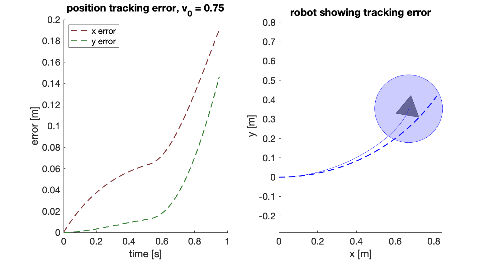

**TL;DR**: See `example_4_tracking_error_single_traj.m`, and try running the script `compute_tracking_error_function.m`.

# Step 2: The Tracking Error Function

#### [Previous step: picking a trajectory-producing model](https://github.com/skousik/RTD_tutorial/tree/master/step_1_desired_trajectories)

Recall that RTD lets us perform receding-horizon planning in a provably correct way despite tracking error. To make such a guarantee, we need to hold on to the tracking error in some way. In this tutorial, we do so by representing the tracking error as a function of time.

## 2.1 Summary

In this step, we use sampling to compute a tracking error function for the TurtleBot. Other methods, such as Sums-of-Squares or Hamilton-Jacobi reachability, could also be used to compute this error function in a more sophisticated way. However, for the purposes of this tutorial, we'll just sample.

### Mathy Overview

Recall that the TurtleBot is described by a **high-fidelity model**, and robot tracks trajectories created by the **trajectory-producing model**. The TurtleBot can't perfectly track the desired trajectories, because it has different dynamics from the robot. But, we can try to bound its tracking error with a **tracking error function**, which we'll denote . We want  to bound the absolute difference between these two models in the position states:
<p align="center"></p>


where  is the tracking error in each position state. We don't care about explicitly bounding the error in the  or  states, since obstacles only exist in  and . Also notice that both  and  influence the position, so  bounds them implicitly. Also notice that the high-fidelity model includes a closed-loop PD controller, which is defined in Appendix 1.B of [the previous section](https://github.com/skousik/RTD_tutorial/tree/master/step_1_desired_trajectories).

This tracking error function is useful as follows. First, assume that the high-fidelity model and trajectory-producing model have the same initial position and heading at the beginning of each planning iteration. Then, all spatial error between the two models can be bounded by the integral of  over time. This lets us use  in the [FRS computation](https://github.com/skousik/RTD_tutorial/tree/master/step_3_FRS_computation).

More formal explanations are available in the papers cited in the [references](https://github.com/skousik/RTD_tutorial#references).

### Goals for This Step

The big takeaway is, for any desired trajectory, the tracking error depends on two things: the robot's initial condition, and the choice of trajectory parameters. Recall that the initial condition of the high-fidelity and trajectory-producing model is assumed to be the same for everything but speed, so only the initial condition in speed affects the tracking error. We'll proceed as follows:

1. Explore the effect of different initial speeds on tracking error.
2. Compute  over a range of initial speeds.


## 2.2 A Single Instance of Tracking Error

First, we'll see how the initial speed affects tracking error. As you vary the initial speed relative to the commanded speed `v_des`, you'll see that the robot does better or worse at tracking.

### Example 4

This code is available in `example_4_tracking_error_single_traj.m`.

#### Example 4.1: An Example Trajectory

First, let's set up the situation:

```matlab
% initial condition
initial_speed = 0.75 ; % m/s

% command bounds
w_des = 1.0 ; % rad/s ;
v_des = 1.0 ; % m/s
```

We also have to set up some timing variables, and the robot:

```matlab
t_plan = 0.5 ;
t_stop = 2.61 ;
t_f = 0.95 ;
t_sample = 0.01 ;

A = turtlebot_agent() ;
A.reset([0;0;0;initial_speed])
```

Now, make the desired trajectory, and include braking for the robot.

```matlab
% desired trajectory
[T_go,U_go,Z_go] = make_turtlebot_desired_trajectory(t_f,w_des,v_des) ;

% trajectory
[T_brk,U_brk,Z_brk] = convert_turtlebot_desired_to_braking_traj(t_plan,t_stop,T_go,U_go,Z_go) ;
```

Track the desired trajectory:

```
A.move(T_brk(end),T_brk,U_brk,Z_brk) ;
```

Now we can visualize the tracking error similar to how we did in Step 1:

```
figure(1) ; hold on ; axis equal ;
plot(Z_go(1,:),Z_go(2,:),'b--','LineWidth',1.5)
plot(A)
```


#### Example 4.2: Computing the Tracking Error

To compute the actual tracking error from this data, we need to normalize time. Recall that the desired trajectory is over the time horizon , but the trajectory with braking takes longer, over the time horizon . The two trajectories are identical up until . Since we are going to compute the FRS for the desired trajectory's regular time horizon later on, we can rescale time for agent's braking trajectory over the time horizon :

```matlab
% initialize time vectors for saving tracking error; we use two to separate
% out the braking portion of the trajectory
T_err_1 = 0:t_sample:t_plan ;
T_err_2 = t_plan:t_sample:t_f ;
T_data = [T_err_1(1:end-1), T_err_2] ;

% split the desired trajectory into before/after t_plan parts
pos_des = Z_go(1:2,:) ;
pos_des_1 = match_trajectories(T_err_1,T_go,pos_des) ;
pos_des_2 = match_trajectories(T_err_2,T_go,pos_des) ;

% get the executed position trajectory
T = A.time ;
pos = A.state(A.position_indices,:) ;

% compute the error before t_plan
pos_1 = match_trajectories(T_err_1,T,pos) ;
pos_err_1 = abs(pos_1 - pos_des_1) ;

% compute the error after t_plan
pos_2 = match_trajectories(T_err_2,T,pos) ;
pos_err_2 = abs(pos_2 - pos_des_2) ;

% create single error data array
pos_err = [pos_err_1(:,1:end-1), pos_err_2] ;

% save data
x_data = pos_err(1,:) ;
y_data = pos_err(2,:) ;
```

Now, we can plot the error data that shows how well the robot braked "along" the desired trajectory:



If you vary the initial speed, the tracking error will change. We'll use that fact next.

#### Remark

The method of rescaling time above only works for _static obstacles_, because we are going to end up computing an FRS that is independent of time. If we're doing things with dynamic obstacles, we must include the fail-safe maneuver explicitly in the desired trajectory, because the FRS has to include time. We have written [a paper that shows how to do this](https://arxiv.org/abs/1902.02851).


## 2.3 Computing the Tracking Error Function

First, we'll compute the tracking error function for just a single initial speed, by varying our choice of commanded speed and yaw rate. Then, we'll compute the tracking error function over a range of speeds.

### Example 5

This code is available in `example_5_tracking_error_single_init_speed.m`. It is nearly identical to Example 4 above, except we sample over the space of  and  as follows. First, set up some bounds:

```matlab
% command bounds
w_min = -1.0 ; % rad/s
w_max =  1.0 ; % rad/s
delta_v = 0.25 ; % m/s

% number of samples in w, and v
N_samples = 4 ;
```

Notice that we have chosen `delta_v` as 0.25 m/s. This means that, at any planning iteration, we are specifying that our desired speed must be within 0.25 m/s of our current speed. Since `t_plan` is 0.5 s, this is an acceleration constraint.

Now, we can create yaw and speed commands:

```matlab
% create yaw commands
w_vec = linspace(w_min,w_max,N_samples) ;

% create the feasible speed commands from the initial condition
v_vec = linspace(initial_speed - delta_v, initial_speed + delta_v, N_samples) ;
```

Finally, we iterate over the `w_vec` and `v_vec` and compute tracking error for each command. See the example script for this code. It produces the following figure:


The blue dashed lines are individual tracking error trajectories. We fit the tracking error function  as a polynomial such that the integral of  over time is greater than the max over all of the trajectories in  and in .

### Computing the Tracking Error Function

Now, we can slightly extend Example 5 by considering a range of initial speeds, which is done by the script `compute_tracking_error_function.m`. First, the user specifies a range of initial speeds:

```matlab
v0_min = 0.5 ; % m/s
v0_max = 1.0 ; % m/s
```

We sample this range of speeds, and compute the tracking error as in Example 5 by taking the max of all tracking errors across all samples. The output looks like this:


This script fits  as a polynomial, and saves the polynomial coefficients and command bound data to the file `turtlebot_error_functions_v0_0.5_to_1.0.mat` by default. The filename changes depending on the range of . In the `step2_error_function/data/` folder,  has been precomputed for three ranges:  m/s,  m/s, and  m/s.

We'll use the tracking error function  to compute an FRS over each initial speed range next.

#### [Next: computing the FRS](https://github.com/skousik/RTD_tutorial/tree/master/step_3_FRS_computation)

