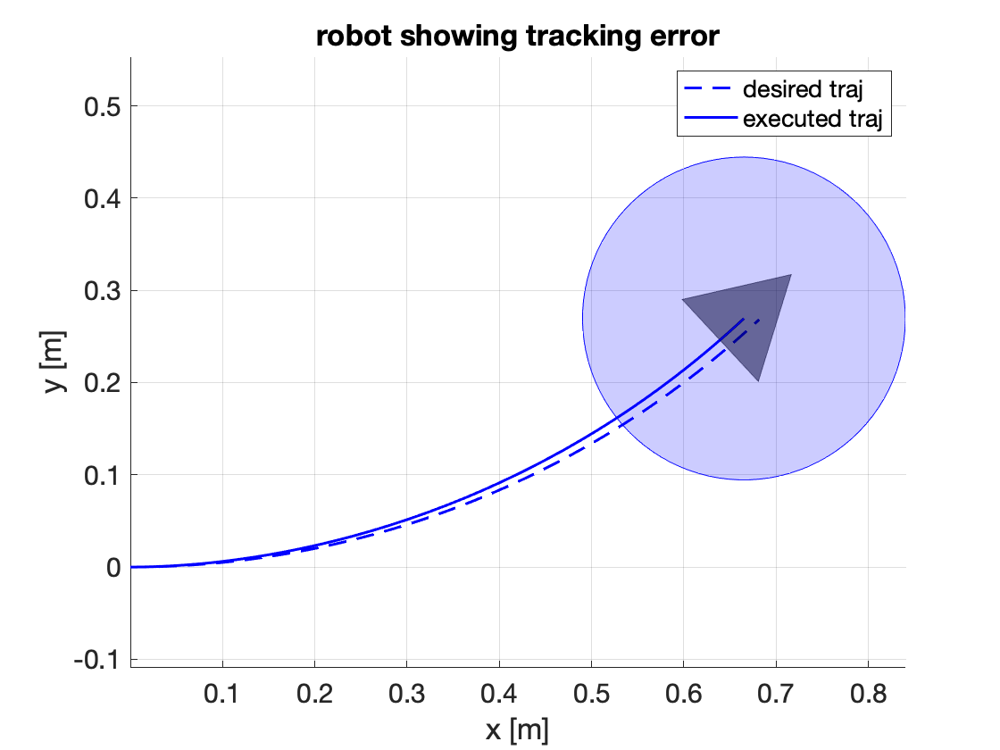
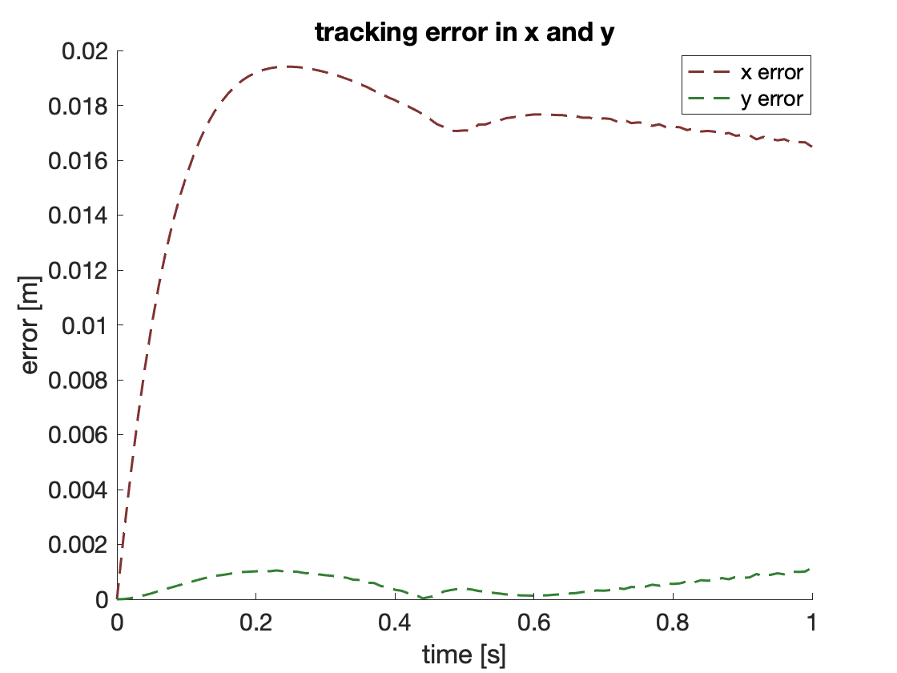
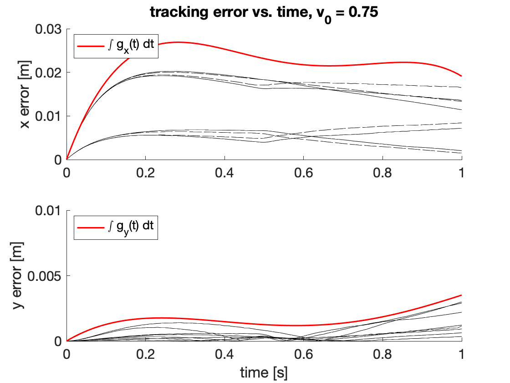
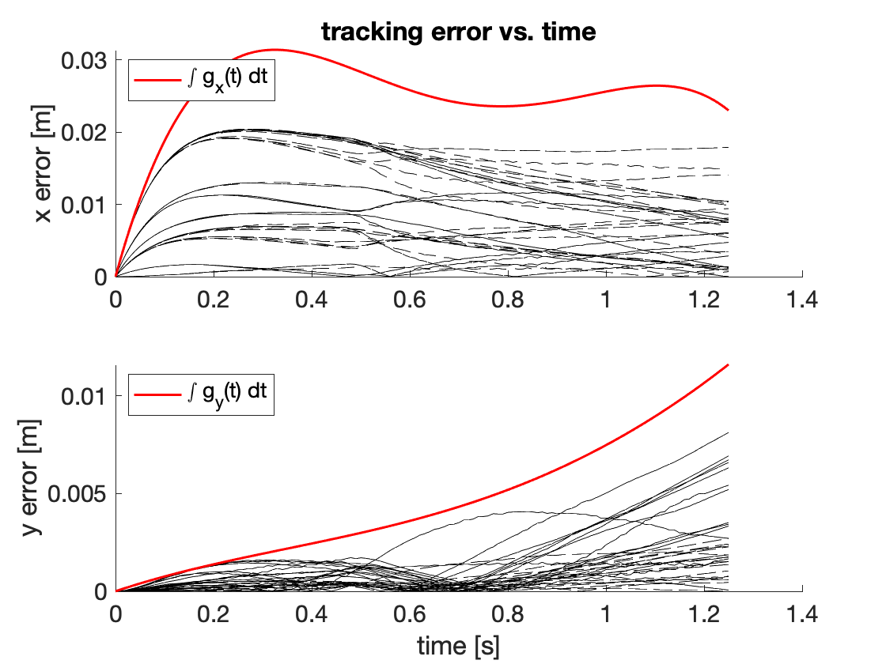

**TL;DR**: Run the script `step_2_compute_tracking_error_function.m`.

# Step 2: The Tracking Error Function

#### [Previous step: picking a trajectory-producing model](https://github.com/skousik/RTD_tutorial/tree/master/step_1_desired_trajectories)

The point of RTD is to perform receding-horizon planning in a provably correct way despite tracking error. To make such a guarantee, we need to hold on to the tracking error in some way. In this tutorial, we do so by representing the tracking error as a function of time.


## Summary

In this step, we use sampling to compute a tracking error function for the TurtleBot. Other methods, such as Sums-of-Squares or Hamilton-Jacobi reachability, could also be used to compute this error function in a more sophisticated way. However, for the purposes of this tutorial, we'll just sample.

### Mathy Overview

Recall that the TurtleBot is described by a **high-fidelity model**, and robot tracks trajectories created by the **trajectory-producing model**. The TurtleBot can't perfectly track the desired trajectories, because it has different dynamics from the robot. But, we can try to bound its tracking error with a **tracking error function**, which we'll denote $g: T \to \mathbb{R}^2$. We want $g$ to bound the absolute difference between these two models in the position states:
$$
\left|
\underbrace{\begin{bmatrix}
  v(t)\cos(\theta(t)) \\
  v(t)\sin(\theta(t)) \\
  u_{\omega}(x,y,\theta,v,k) \\
	u_a(x,y,\theta,v,k)
\end{bmatrix}}_{\mathrm{high-fid.\ model}}
-
\underbrace{\begin{bmatrix}
  k_2\cos(k_1t) \\
  k_2\sin(k_1t) \\
  k_1 \\
  0
\end{bmatrix}}_{\mathrm{traj-prod.\ model}}
\right|
\leq
\begin{bmatrix}
	g_x(t) \\
	g_y(t) \\
	\cdot \\
	\cdot
\end{bmatrix}
$$


where $g = (g_x, g_y)$ is the tracking error in each position state and $u_{\omega}, u_a$ are controllers that do feedback about the trajectory parameterized by $k = (k_1,k_2)$. In particular, these controllers are explained in Appendix 1.B of [the previous section](https://github.com/skousik/RTD_tutorial/tree/master/step_1_desired_trajectories).

We don't care about explicitly bounding the error in the $\theta$ or $v$ states, since obstacles only exist in $x$ and $y$. Also notice that both $\theta$ and $v$ influence the position, so $g$ bounds them implicitly.

This tracking error function is useful as follows. First, assume that the high-fidelity model and trajectory-producing model have the same initial position and heading at the beginning of each planning iteration. Then, all spatial error between the two models can be bounded by the integral of $g$ over time. This lets us use $g$ in the [FRS computation](https://github.com/skousik/RTD_tutorial/tree/master/step_3_FRS_computation).

More formal explanations are available in the papers cited in the [references](https://github.com/skousik/RTD_tutorial#references).

### Goals for This Step

The big takeaway is, for any desired trajectory, the tracking error depends on two things: the robot's initial condition, and the choice of trajectory parameters. Recall that the initial condition of the high-fidelity and trajectory-producing model is assumed to be the same for everything but speed, so only the initial condition in speed affects the tracking error.

In this step, we'll do the following:

1. Inspect the tracking error for a single initial condition of the Turtlebot while tracking a single trajectory
2. Estimate the **tracking error function** $g$ by looking at a variety of initial conditions and trajectories


## 2.1 A Single Instance of Tracking Error

First, we'll see how the initial speed affects tracking error. As you vary the initial speed relative to the commanded speed `v_des`, you'll see that the robot does better or worse at tracking.

### Example 1

The following code is in `step_2_ex_1_tracking_error_single_traj.m`.

#### Example 1.1: An Example Trajectory

First, let's set up the situation and the robot

```matlab
% initial condition
v_0 = 0.75 ; % m/s

% command bounds
w_des = 1.0 ; % rad/s ;
v_des = 1.0 ; % m/s

% create turtlebot
A = turtlebot_agent ;

% create the initial condition
z0 = [0;0;0;v_0] ; % (x,y,h,v)
A.reset(z0)
```

Now, make the desired trajectory.

```matlab
t_f = get_t_f_from_v_0(v_0) ;
[T_des,U_des,Z_des] = make_turtlebot_desired_trajectory(t_f,w_des,v_des) ;
```

Then, track the desired trajectory:

```
A.move(T_des(end),T_des,U_des,Z_des) ;
```

We can visualize the tracking error similar to how we did in Step 1:

```matlab
figure(1) ; hold on ; axis equal ;
plot_path(Z_des,'b--','LineWidth',1.5)
plot_path(Z,'b','LineWidth',1.5)
plot(A)
```




#### Example 1.2: Computing the Tracking Error

We compute the tracking error by directly comparing the realized trajectory to the planned trajectory:

```matlab
% get the realized position trajectory
T = A.time ;
Z = A.state(A.position_indices,:) ;

% interpolate the realized trajectory to match the braking traj timing
pos = match_trajectories(T_des,T,Z) ;

% get the desired trajectory
pos_des = Z_des(1:2,:) ;

% compute the tracking error
pos_err = abs(pos - pos_des) ;
x_err = pos_err(1,:) ;
y_err = pos_err(2,:) ;
```

If we plot the tracking error, we see that it's under 2cm for the whole trajectory duration:




#### Remark

We are only looking at the tracking error for _non-braking_ trajectories. This is because we will compute our reachability analysis for such trajectories in Step 3, and because we know from Step 1 that our braking trajectories travel less far than non-braking trajectories. Furthermore, since the Turtlebot's yaw rate and acceleration are decoupled in its dynamic mode, and the yaw tracking error is what causes an offset from our trajectory over its entire time horizon, the tracking error will not be worse when tracking a braking trajectory versus a non-braking trajectory. You can verify this for yourself by looking at `step_2_inspect_turtlebot_desired_vs_braking_traj.m`.

Note that, if we're doing things with dynamic obstacles, we must include the fail-safe maneuver explicitly in the desired trajectory, because the FRS has to include time. We have written [a paper that shows how to do this](https://arxiv.org/abs/1902.02851).


## 2.2 Computing the Tracking Error Function

First, we'll compute the tracking error function for just a single initial speed, by varying our choice of commanded speed and yaw rate. Then, we'll compute the tracking error function over a range of speeds.

### Example 2

This code is available in `step_2_ex_2_tracking_error_single_init_speed.m`. It is nearly identical to the previous example, except we sample over the space of $\omega$ and $v$ as follows. First, set up some bounds:

```matlab
% command bounds
w_min = -1.0 ; % rad/s
w_max =  1.0 ; % rad/s
delta_v = 0.25 ; % m/s

% number of samples in w and v
N_samples = 4 ;
```

Notice that we have chosen `delta_v` as 0.25 m/s. This means that, at any planning iteration, we are specifying that our desired speed must be within 0.25 m/s of our current speed. Since `t_plan` is 0.5 s, this is an acceleration constraint.

Now, we can create yaw and speed commands:

```matlab
% create yaw commands
w_vec = linspace(w_min,w_max,N_samples) ;

% create the feasible speed commands from the initial condition
v_vec = linspace(initial_speed - delta_v, initial_speed + delta_v, N_samples) ;
```

Finally, we iterate over the `w_vec` and `v_vec` and compute tracking error for each command. See the example script for this code. It produces the following figure:



The black dashed lines are individual tracking error trajectories. We fit the tracking error function $g$ as a polynomial such that the integral of $g$ over time is greater than the max over all of the trajectories in $x$ and in $y$.


### Computing the Tracking Error Function

Now, we can compute the tracking error over a a range of initial speeds, which is done by the script `step_2_compute_tracking_error_function.m`. First, we specify a range of initial speeds:

```matlab
v_0_min = 1.0 ; % m/s
v_0_max = 1.5 ; % m/s
```

We sample this range of speeds, and compute the tracking error by taking the max of all tracking errors across all samples. The output looks like this:




This script fits the tracking error function $g$ as a polynomial to upper bound the data. It then saves the polynomial coefficients and command bound data to the file `turtlebot_error_functions_v_0_1.0_to_1.5.mat` by default. The filename changes depending on the range of initial speeds. In the `step_2_error_function/data/` folder, $g$ has been precomputed for three ranges: 0.0 - 0.5 m/s, 0.5 - 1.0 m/s, and 1.0 - 1.5 m/s.

We'll use the tracking error function to compute an FRS over each initial speed range next.

#### [Next: computing the FRS](https://github.com/skousik/RTD_tutorial/tree/master/step_3_FRS_computation)

