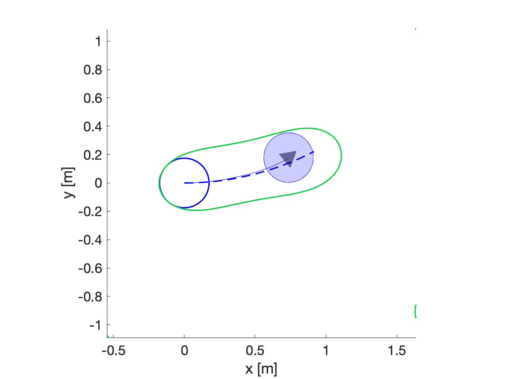
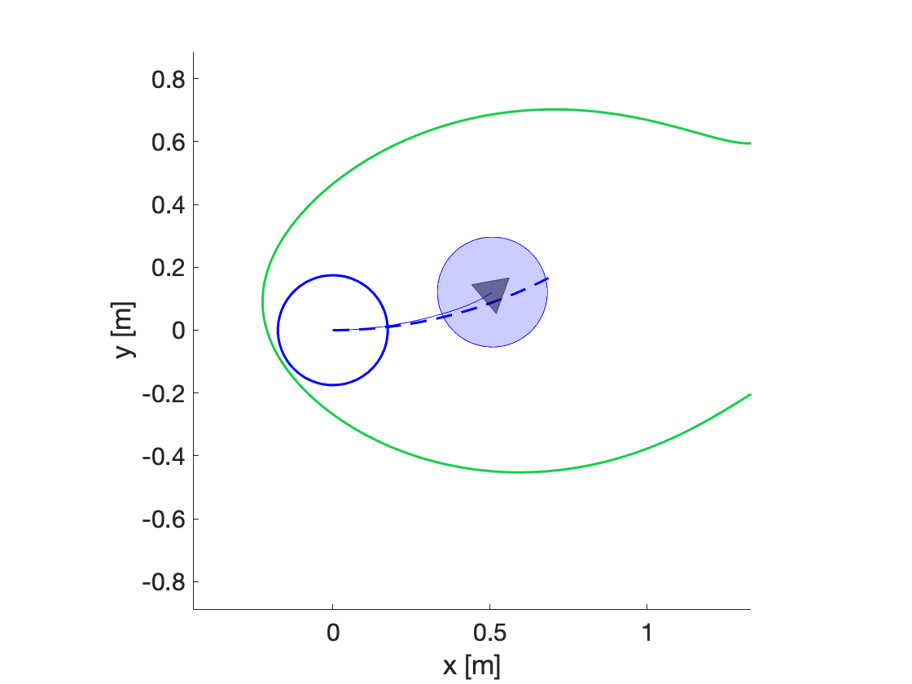
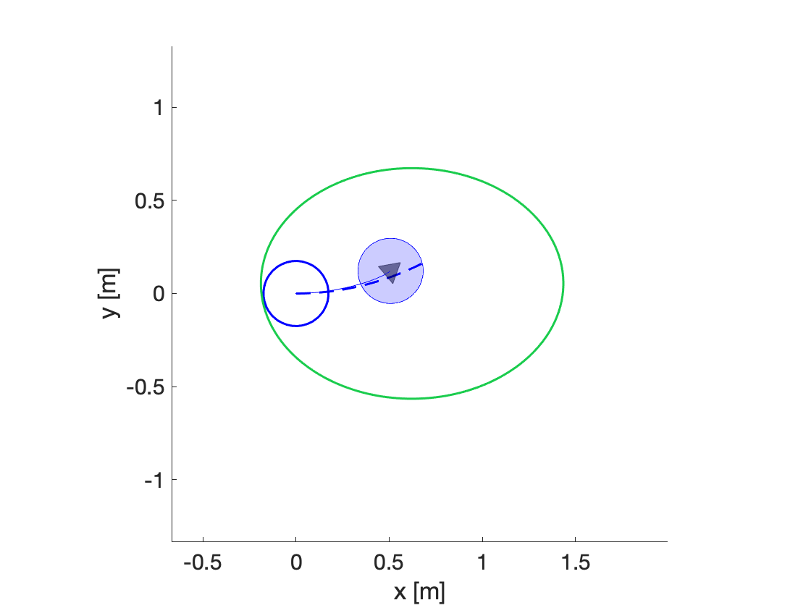
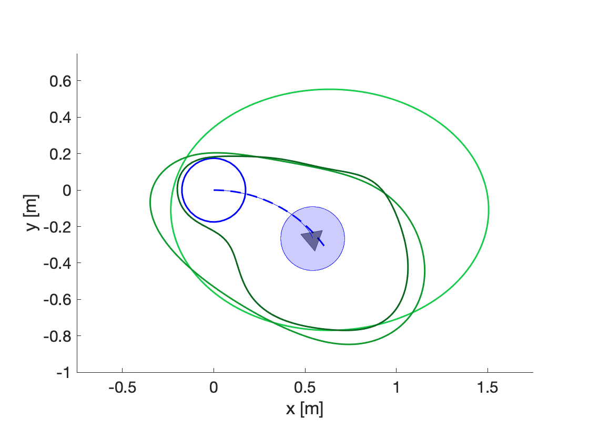

**TL;DR**: See `example_7_compute_turtlebot_FRS.m`, and run the script `compute_turtlebot_FRS.m`.

# Step 3: Forward Reachable Set Computation

#### [Previous step: computing tracking error](https://github.com/skousik/RTD_tutorial/tree/master/step_2_error_function)

Now that we have a [dynamic model](https://github.com/skousik/RTD_tutorial/tree/master/step_1_desired_trajectories) and a [tracking error function](https://github.com/skousik/RTD_tutorial/tree/master/step_2_error_function), we can compute a Forward-Reachable Set (FRS) for the TurtleBot. Note that there are also simple examples of the FRS computation in the [RTD repository](https://github.com/ramvasudevan/RTD/tree/master/examples/offline_FRS_computation).

## 3.1 Summary

In this step, we use sums-of-squares (SOS) programming to conservatively approximate an indicator function the FRS of the TurtleBot. We could also use other reachability methods, but this one lets us represent the FRS with polynomials, which end up being useful for online planning in the next step.

### Mathy Overview

Note, you can skip this mathy bit if you want. The important takeaways are listed in the "Goals for This Step" below.

We define the FRS as follows. Consider all points in space that the TurtleBot's body can reach while tracking any of our parameterized trajectories. The FRS, denoted $F$, is all such points, paired with the corresponding trajectory parameters that caused those points to be reached. In other words, if $(x,y)$ is a point that _any point_ on the robot reaches while tracking $k$, then the point $(x,y,k)$ is in $F$. We write this all more formally next.

First, let $f: T \times Z \times K \to \mathbb{R}^2$ denote the trajectory-producing model. The space $T$ is time as before. The space $Z$ is the Cartesian plane containing points denoted $(x,y)$. The space $K$ is the trajectory parameter space, so we can write $k = (k_1,k_2) \in K$. Then, the model is:
$$
f(t,z,k) = \begin{bmatrix} k_2 - k_1\cdot(y - y_0) \\ k_2\cdot(x - x_0)\end{bmatrix}
$$


as in [Appendix 1.A](https://github.com/skousik/RTD_tutorial/tree/master/step_1_desired_trajectories#appendix-1a-rigid-body-dynamics), where we used the fact that the desired yaw rate $k_1$ is fixed over $T$ to get rid of the heading dimension $\theta$. This model works for _any point_ on the robot and expresses the robot's rigid body motion. The point $(x_0,y_0) \in Z$ is the robot's center of mass at the beginning of any desired trajectory (i.e., when $t = 0$).

Now we can write a definition for $F$. Recall that the tracking error function is denoted $g: T \to \mathbb{R}^2$, and we write it $g = (g_x,g_y)$ for each of the position states. Let $d_x, d_y: T \to [-1,1]$ denote arbitrary "disturbance" functions that are _absolutely integrable_:
$$
\int_T |d_x(t)| dt < \infty\quad\mathrm{and}\quad\int_T |d_y(t)| dt < \infty
$$


We can use $d_x$ and $d_y$ to add the tracking error to $f$, which lets use define the FRS:
$$
\begin{align}
F = \Big\{(z,k)\ |\ &\exists\ t \in T,\ d_x,\ d_y,\ \mathrm{and}\ z_0 \in Z_0\ \mathrm{s.t} \\
&\dot{\tilde{z}} = f + g\circ [d_x, d_y]^\top~\mathrm{and}~\tilde{z}(t) = z\Big\},
\end{align}
$$


where $Z_0$ is the set containing the robot's body at $t = 0$, and the notation $\circ$ denotes the elementwise product:
$$
g\circ[d_x,d_y]^\top = \begin{bmatrix} g_x\cdot d_x \\ g_y \cdot d_y\end{bmatrix}.
$$


### Goals for This Step

The key takeaways from the math are the following. We use $f$ to denote the trajectory-producing model, and $Z_0$ to denote the robot's body or "footprint" at the beginning of any planning iteration. We use $K$ to denote the space of trajectory parameters, and $Z$ to denote the plane of $(x,y)$ points. We proceed as follows:

1. Compute an FRS for a single desired trajectory (i.e. a single $k \in K$) without tracking error
2. Compute the FRS for all possible desired trajectories, plus tracking error

The first computation is to illustrate what the FRS looks like. The second computation gives us the FRS itself, to use for online planning. Note that computing an FRS that is not too conservative requires tens of gigabytes of RAM. We've gone ahead and done this for you on a big beefy computer; the FRSes are available as .mat files in the [data folder of this step](https://github.com/skousik/RTD_tutorial/tree/master/step_3_FRS_computation/data/reach_sets).


## 3.2 FRS for a Single Trajectory

Now we'll compute the FRS for a single desired trajectory, to illustrate how the FRS computation is written as a SOS program with spotless and MOSEK. The following code is all in `example_6_FRS_with_fixed_traj_params.m`. We'll walk through it in a slightly different order here.

### Example 6

First, let's figure out what SOS program we even want to solve. The generic program is Program $(D)$ on page 10 of this [super-duper long paper](https://arxiv.org/pdf/1809.06746.pdf). That program computes a polynomial $w: Z \times K \to \mathbb{R}$ for which, if $(z,k)$ is in the FRS $F$, then $w(z,k) \geq 1$. We want to do the same thing, but for just one $k \in K$, which will make a much smaller computation that can run on a laptop. So, let's first pick $k$ by running the following in the MATLAB command window:

```matlab
% chosen command
w_des = 0.5 ; % rad/s
v_des = 1.0 ; % m/s
```


#### Example 6.1: Scaling the SOS Program

Since we're computing with SOS polynomials, the first thing we need to do is scale the entire problem so that each variable lives in the domain $[-1,1]$, and so that time lives in $[0, 1]$. Otherwise, the problem can become numerically unstable and won't converge nicely (think about what happens when you evaluate $x^6$ on $x > 1$). To scale the problem down, we'll figure out how "far" out trajectory-producing model travels given the command above. 

First, we'll scale time to $[0,1]$. Recall that, in [Step 1.5](https://github.com/skousik/RTD_tutorial/tree/master/step1_desired_trajectories), we found $t_f = 0.95$ s as our time horizon to include a fail-safe maneuver. So, if we multiply $f$ by $t_f$, then the dynamics are scaled by time, so that they'll go as far over $1$ normalized second as they would've originally over $0.95$ s. Run the following lines to set up the timing variables:

```matlab
t_plan = 0.5 ;
t_f = 0.95 ;
t_stop = 2.61 ;
```

You could also just run `load('turtlebot_timing.mat')` in the command window to get these into your workspace.

Now, let's get the desired trajectory for the given command, to figure out how to scale the rest of the problem:

```matlab
% make the trajectory we are computing an FRS for; notice that the dynamics
% are time-scaled by t_f, then ode45 is called over the time horizon [0,1],
% since we are going to normalize time in the FRS computation
T = [0, 1] ;
U = [w_des, w_des ; v_des, v_des] ;
z0 = zeros(3,1) ;
[~,Z] = ode45(@(t,z) t_f.*turtlebot_trajectory_producing_model(t,z,T,U),T,z0) ;
Z = Z' ; % transpose to get column trajectory format
```

We can figure out how far this desired trajectory traveled, including the robot's footprint:

```matlab
% get the robot's footprint
A = turtlebot_agent ;
footprint = A.footprint ;

% figure out how far the robot traveled in x and y, and add the footprint
dx = max(Z(1,:)) - min(Z(1,:)) + footprint ;
dy = max(Z(2,:)) - min(Z(2,:)) + footprint ;
```

Finally, we'll scale and shift the problem to be in $[-1,1]$ in the $x$ and $y$ coordinates (i.e., in the space $Z$):

```matlab
% pick a scaling factor that makes the larger of dx and dy equal to 1, then
% make the center-of-mass dynamics start at (-0.5,0) when scaled
time_scale = t_f ;
distance_scale = max(dx,dy) ;
initial_x = -0.5 ;
initial_y =  0.0 ;
```


#### Example 6.2: Little FRS Computation Program

For this example, we don't care about tracking error. So, we just want to find everywhere the trajectory-producing model can reach while going at the desired yaw rate and speed. We'll do so with the following program:
$$
\begin{array}{clll}
{\underset{V, I}{\inf}} & {\int_{Z} I(z) d \lambda_{Z}} & {} & {}\\
{\text { s.t. }} & {\mathcal{L}_fV(t,z) \leq 0} & {} & {\forall~(t,z) \in T\times Z} \\
{} & {V(0,z) \leq 0} & {} & {\forall~z \in Z} \\
{} & {I(z) \geq 0} & {} & {\forall~z \in Z} \\
{} & {V(t,z) + I(z) - 1 \geq 0} & {} & {\forall~(t,z) \in T\times Z}
\end{array}
$$


The decision variables in this program are the functions $V$ and $I$. This is different from the notation $(v,w)$ for the same decision variables in the [paper](https://arxiv.org/pdf/1809.06746.pdf) that we're referencing, to avoid confusion with the state $v$ and control input $\omega$. We're using $V$ to denote what is very similar to a [Lyapunov function](https://en.wikipedia.org/wiki/Lyapunov_function) for our dynamics, and $I$ to denote what is very similar to an [indicator function](https://en.wikipedia.org/wiki/Indicator_function) on our FRS.

Also, note that the _total derivative_ of $V$ with respect to $f$ is given by:
$$
\mathcal{L}_fV(t,z) = \frac{\partial}{\partial t} V(t,z) + \frac{\partial}{\partial x}V(t,z)\cdot f_x(z,k) + \frac{\partial}{\partial x}V(t,z)\cdot f_y(z,k),
$$


where $f = [f_x, f_y]^\top$ for notational convenience, and $k$ is the chosen desired trajectory above. So, the first constraint in the program above tells us that $V$ must be decreasing along trajectories of $f$.

Note, this isn't a SOS program yet! This is an infinite-dimensional program, since the constraints have to hold for uncountably many $t \in T$ and $(x,y) \in Z$. In addition, the decision variables as written are just generic functions. To turn this into a finite-dimensional SOS program, we specify $V$ and $I$ as polynomials of finite degree on $T\times Z$ and $Z$ respectively. This lets use represent the infinite number of constraints with a finite number of polynomial coefficients using a [beautiful math trick](https://en.wikipedia.org/wiki/Stengle's_Positivstellensatz). Luckily, all that representation stuff is taken care of us in the background by spotless.


#### Example 6.3: Setting Stuff Up for the SOS Program

The first step to creating a SOS program with spotless is to set up the "indeterminates," which are not the decision variables, but rather are variables that the decision variables are made out of:

```matlab
t = msspoly('t', 1) ; % time t
z = msspoly('z', 2) ; % states z = (x,y)
x = z(1) ;
y = z(2) ;
```

The second step is to specify the spaces $T$ and $Z$ as semi-algebraic sets. In other words, we want to specify polynomials $h_T$ and $h_Z$ that are positive on $T$ and $Z$:
$$
\begin{align}
T &= \{t \in \mathbb{R}~|~h_T(t) \geq 0\} \\
Z &= \{(x,y) \in \mathbb{R}^2~|~h_Z(x,y) \geq 0\}
\end{align}
$$


But, we also want to scale $T$ to $[0,1]$ and $Z$ to $[-1,1]^2 \subset \mathbb{R}^2$. So, we'll specify the sets like this:

```matlab
hT = t * (1 - t) ;
hZ = (z - [-1;-1]) .* ([1;1] - z) ;
```


Basically, this just defines quadratic functions that are positive where we want them to be. We'll also do something similar for $Z_0$, which is a circle containing the robot's entire footprint at $t = 0$:

```matlab
% create a circular footprint for the initial condition
h_Z0 = 1 - ((x - initial_x)/(footprint/distance_scale)).^2 + ...
         - ((y - initial_y)/(footprint/distance_scale)).^2 ;
```


This is a paraboloid in $Z$ that is positive on $Z_0$.

The last thing to do is make the trajectory-producing model scaled down for the domain we're considering:

```matlab
% create trajectory-producing model
scale = (time_scale/distance_scale) ;
f = scale*[v_des - w_des*(y - initial_y) ;
                 + w_des*(x - initial_x)] ;
```


#### Example 6.4: Constructing the SOS Program Itself

Now, we can use our indeterminates and semi-algebraic set definitions to create the spotless program. First, initialize the program and indeterminates, and specify the polynomial degree to use:

```matlab
% initialize program and indeterminate variables
prog = spotsosprog;
prog = prog.withIndeterminate(t) ;
prog = prog.withIndeterminate(z) ;

degree = 6 ;
```

Now we'll create $V$ and $I$ as our decision variables:

```matlab
% create monomials for decision variable polynomials; v is like a Lyapunov
% function and w is like an indicator function on the FRS
V_mon = monomials([t;z], 0:degree) ;
I_mon = monomials(z, 0:degree) ;

% create the decision variable polynomials
[prog, V, ~] = prog.newFreePoly(V_mon) ;
[prog, I, I_coeff] = prog.newFreePoly(I_mon) ;
```

Next, we need to create the constraints of the SOS program. Luckily, spotless makes this super easy:

```matlab
% create variables for the constraints of the program (D)
t0 = 0 ;
V0 = subs(V,t,t0) ;
dVdt = diff(V,t) ;
dVdz = diff(V,z) ;
LfV = dVdt + dVdz*f ;

% define each constraint from program (D), ignoring the ones containing q
% (which represents the tracking error)

% -LfV > 0 on T x Z
prog = sosOnK(prog, -LfV, [t;z], [h_T; h_Z], degree) ;

% -V(0,.) > 0 on Z0
prog = sosOnK(prog, -V0, z, h_Z0, degree) ;

% I > 0 on Z
prog = sosOnK(prog, I, z, h_Z, degree) ;

% V(t,.) + I - 1 > 0 on T x Z
prog = sosOnK(prog, V + I - 1, [t;z], [h_T; h_Z], degree) ;
```

The last constraint is what forces $I$ to be greater than or equal to $1$ on the FRS. Recall that $V$ is decreasing along trajectories, and, by the second constraint, it also has to be negative on the set of initial conditions. So, by the last constraint, $I(z) > 1 - V(t,z)$ means that $I(z) \geq 1$ on points that are reached by trajectories of the system (i.e., the FRS).

Finally, we create the cost function. Notice that it's just the integral of $I$ over $Z$; in other words, our SOS program is trying to "shrinkwrap" $I$ to fit around the FRS.

```matlab
% define the cost function (the integral of I over the domain Z)
int_Z = boxMoments(z, [-1;-1], [1;1]) ; % this integrates I over Z
obj = int_Z(I_mon)' * I_coeff ; 
```


#### Example 6.5: Solving the SOS Program

Really, all the effort is spent setting stuff up. To solve the program, first create options for the solver:

```matlab
options = spot_sdp_default_options() ;
options.verbose = 1 ;
options.domain_size = 1;
options.solveroptions = [];
```

Now, solve it with MOSEK:

```matlab
sol = prog.minimize(obj, @spot_mosek, options) ;
```

This takes about 0.46​ s to solve on a 2016 Macbook Pro 15" laptop.


#### Example 6.6: Results

We care about using $I$, so let's get it:

```matlab
I_sol = sol.eval(I) ;
```

We want to see that $I$ is greater than or equal to 1 where the trajectory-producing model went. So, let's create the desired trajectory:

```matlab
[T_go,U_go,Z_go] = make_turtlebot_desired_trajectory(t_f,w_des,v_des) ;
```

It'll also be nice to see how close the robot gets while tracking this desired trajectory from a variety of initial speeds. Set that up as follows:

```matlab
initial_speed = 0.75 ; % m/s

% create the initial condition
z0 = [0;0;0;initial_speed] ; % (x,y,h,v)

% create the braking trajectory (i.e., include the fail-safe maneuver)
[T_brk,U_brk,Z_brk] = convert_turtlebot_desired_to_braking_traj(t_plan,t_stop,T_go,U_go,Z_go) ;

% move the robot
A.reset(z0)
A.move(T_brk(end),T_brk,U_brk,Z_brk) ;
```

Now, we can visualize the output:

```matlab
figure(1) ; clf ; axis equal ; hold on ;

% plot the initial condition
offset = -distance_scale*[initial_x;initial_y] ;
plot_2D_msspoly_contour(h_Z0,z,0,'LineWidth',1.5,'Color','b',...
    'Offset',offset,'Scale',distance_scale)

% plot the FRS
plot_2D_msspoly_contour(I_sol,z,1,'LineWidth',1.5,'Color',[0.1 0.8 0.3],...
    'Offset',offset,'Scale',distance_scale)

% plot the desired trajectory
plot(Z_go(1,:),Z_go(2,:),'b--','LineWidth',1.5)

% plot the agent
plot(A)
```

You should see something like this:




The green contour is the level set $I(z) \geq 1$. The dark blue circle at the origin is the initial condition set $Z_0$. Notice that both the FRS and the initial condition set are unscaled by `distance_scale` and unshifted by `initial_x` and `initial_y` by using the `'Scale'` and `'Offset'` arguments in the plotting function.

The desired trajectory for $k = (0.5\ \mathrm{rad/s}, 1.0\ \mathrm{m/s})$ is shown as the blue dashed line. Notice that it fits entirely inside the FRS contour. In other words, the trajectory-producing model is indeed inside the FRS.

The blue circle with an arrow is the robot, which executes a trajectory with braking. Notice that it just barely fits inside the FRS. If you vary the `initial_speed` variable and run the robot again, it'll end up somewhere else. Some initial conditions will cause the robot to leave the FRS contour (try `initial_speed = 1.5`). This means we definitely need to include tracking error.

Note that, in the bottom right, there is a little bit of green. This is actually also part of the FRS contour which results from the fact that we only used a degree 6 polynomial. Since the SOS program's numerical implementation produces a conservative result, there are sometimes such artifacts, which say the robot can somehow teleport to the very edges of the $[-1,1]^2$ space. We can ignore these artifacts at runtime to prevent super conservative behavior. Recall that we distance-scaled the entire FRS based on the robot's dynamics. This means that the _actual_ FRS lies in the unit disc in the scaled and shfited coordiantes used by the SOS program. So, online, we only need to consider obstacles that lie in the unit disc when scaled and shifted down. We'll write the code to do that in the [online planning step](https://github.com/skousik/RTD_tutorial/tree/master/step_4_online_planning).


## 3.3 Computing the FRS

Now we can compute the entire FRS for the TurtleBot. First, we'll pick a range of initial speeds and command inputs over which to compute the FRS. Then, we'll find the distance scale required to make sure the SOS program is numerically stable. Finally, we'll compute the FRS.

#### Initial Condition and Input Ranges

Recall that we [computed the tracking error](https://github.com/skousik/RTD_tutorial/tree/master/step_3_FRS_computation) for three different initial speed ranges: 0.0 — 0.5 m/s, 0.5 — 1.0 m/s, and 1.0 — 1.5 m/s. The point of doing this was that the error function is smaller for the smaller speed ranges, which will make our TurtleBot less conservative in online planning. But, it means we need to compute a separate FRS for each of these ranges.

Let's pick the 0.0 — 0.5 m/s speed range for now. All the code below will work for any fo the ranges.

#### Distance Scale

Code for this in the script `compute_FRS_distance_scale.m`. We'll just discuss results here, since it's pretty similar to how we computed the distance scale above. The distance scale required for each initial speed range is as follows:

| Initial Speed Range [m/s] | Distance Scale [m] |
| ------------------------- | ------------------ |
| 0.0 — 0.5                 | 0.89               |
| 0.5 — 1.0                 | 1.37               |
| 1.0 — 1.5                 | 1.75               |

These are saved in .mat files in `step_3_FRS_computation/data/scaling`.

#### Compute the FRS

Code for the FRS computation is in the script `compute_turtlebot_FRS.m`. We'll walk through Example 7, which is a simplified version, so you can see what's different from the FRS computation above. This shows how to use the `compute_FRS` function. This is really similar to the `FRS_computation_example_4.m` script in the [RTD repository](https://github.com/ramvasudevan/RTD).

### Example 7

Let's find the FRS for the 0.0 — 0.5 m/s case. This code is in `example_7_compute_turtlebot_FRS.m`. Before writing any code, let's specify the optimization program we'll use to find the FRS:
$$
\begin{array}{clll}
{\underset{V, I, D_1, D_2}{\inf}} & {\int_{Z\times K} I(z, k) d \lambda_{Z\times K}} & {} & {}\\
{\text { s.t. }} & -{\mathcal{L}_fV(t,z,k) + D_1(t,z,k) + D_2(t,z,k) \geq 0} & {} & {\forall~(t,z,k) \in T\times Z\times K} \\
{} & {D_i(t,z,k) - \mathcal{L}_g(t,z,k) \geq 0} & {} & {\forall~(t,z,k) \in T\times Z\times K~\mathrm{and}~i = 1, 2} \\
{} & {D_i(t,z,k) + \mathcal{L}_g(t,z,k) \geq 0} & {} & {\forall~(t,z,k) \in T\times Z\times K~\mathrm{and}~i = 1, 2} \\
{} & {D_i(t,z,k) \geq 0} & {} & {\forall~(t,z,k) \in T\times Z\times K~\mathrm{and}~i = 1, 2} \\
{} & {-V(0,z,k) \geq 0} & {} & {\forall~(z,k) \in Z\times K} \\
{} & {I(z,k) \geq 0} & {} & {\forall~(z,k) \in Z\times K} \\
{} & {V(t,z,k) + I(z,k) - 1 \geq 0} & {} & {\forall~(t,z,k) \in T\times Z\times K}
\end{array}
$$


Woof, that's a lot to look at! But this is indeed Program $(D)$ on page 10 of the [Big Paper](https://arxiv.org/abs/1809.06746), just specialized to the case where $Z$ is 2D. We'll specify that $V, I, D_1,$ and $D_2$ are all SOS polynomials of finite degree. Notice that we've added $K$ in to the program, because we're not just computing the FRS for a single, fixed $k \in K$ any more.

The new decision variables $D_1$ and $D_2$, written as $q_i$ in the paper, are "disturbance" variables. These polynomials will represent our $d_x$ and $d_y$ scaling factors for the tracking error. Notice that the tracking error is incorporated using the total derivative of $V$ with respect to $g$:
$$
\mathcal{L}_gV(t,z) = \frac{\partial}{\partial t} V(t,z) + \frac{\partial}{\partial x}V(t,z)\cdot g_x(z,k) + \frac{\partial}{\partial x}V(t,z)\cdot g_y(z,k).
$$


Next, we'll set up all the objects required to actually solve this program with spotless and MOSEK. Luckily, we don't have to write the whole program out — it will be generated for us automatically by `compute_FRS`.


#### Example 7.1: Set up Timing and Spaces

First, load the relevant info and pick the SOS polynomial degree:

```matlab
degree = 4 ; % this will solve super quick

% load timing, error functions, and distance scale
load('turtlebot_timing.mat')
load('turtlebot_error_functions_v0_0.0_to_0.5.mat')
load('turtlebot_FRS_scaling_v0_0.0_to_0.5.mat')
```

We'll also set up the TurtleBot agent to get its footprint:

```matlab
A = turtlebot_agent ;
footprint = A.footprint ;
```

Now, set up the FRS computation indeterminates:

```matlab
t = msspoly('t', 1) ; % time t \in T
z = msspoly('z', 2) ; % state z = (x,y) \in Z
k = msspoly('k', 2) ; % parameters k \in K

x = z(1) ; y = z(2) ;
```

Next, create the polynomials that define the semi-algebraic representations of our spaces: the plane $Z$, the initial footprint of the robot $Z_0$, and the parameters $K$. Note that the $h_T$ to represent $T$ is automatically generated by the `compute_FRS` function.

```matlab
Z_range = [-1, 1 ; -1, 1] ; % z \in [-1,1]^2

Z0_radius = footprint/distance_scale ; % z(0) \in Z_0

K_range = [-1, 1 ; -1, 1] ; % k \in [-1,1]^2

h_Z = (z - Z_range(:,1)).*(Z_range(:,2) - z) ;

h_Z0 = 1 - ((x - initial_x)/(footprint/distance_scale)).^2 + ...
         - ((y - initial_y)/(footprint/distance_scale)).^2 ;

h_K = (k - K_range(:,1)).*(K_range(:,2) - k) ;
```


#### Example 7.2: Set up the Dynamics

Notice that $K = [-1,1]^2$; in other words, we are letting $k_1$ and $k_2$ vary between -1 and 1. But our desired yaw rate and speed aren't always between -1 and 1, so, we have to write them in terms of $k$. The yaw rate is pretty easy:

```
w_des = w_max*k(1) ;
```

The speed is a little bit more complex. Recall that we picked 0.25 m/s as `delta_v` when computing the [tracking error functions](https://github.com/skousik/RTD_tutorial/tree/master/step_2_error_function). This value gives our maximum allowable change in the commanded speed versus the current speed. So, first, we'll establish a range of allowable $v$ that we can command:

```
v_range = [v0_min - delta_v, v0_max + delta_v] ;
v_range = bound_values(v_range,[0, max_speed]) ;
```

Notice that we also bounded this by the `max_speed` of 1.5 m/s. Now, since $k_2$ varies between -1 and 1, we need to make $k_2 = -1$ correspond to the lower end of `v_range` and $k_2 = 1$ correspond to the upper end:

```
v_des = (diff(v_range)/2)*k(2) + mean(v_range) ;
```

Now, we can write our dynamics in terms of our commanded $\omega$ and $v$:

```matlab
% create dynamics
scale = (time_scale/distance_scale) ;
f = scale*[v_des - w_des*(y - initial_y) ;
                 + w_des*(x - initial_x)] ;
```

Notice that these dynamics are now nonlinear with respect to our indeterminates! They are polynomials in $z$ and $k$.


#### Example 7.3: Set up the Tracking Error Function

Next, we have to define $g$. First, let's get $g_x$ and $g_y$. Recall that they are both degree 3 polynomials of time, so we'll first create monomials $1, t, t^2, t^3$:

```matlab
t_mon = [t^3 t^2 t^1 1] ; % this order matches the order of the g coefficients
```

Now we'll make $g_x$ and $g_y$:

```matlab
g_x = t_mon * g_x_coeffs' ;
g_y = t_mon * g_y_coeffs' ;
```

Recall that we create functions $d_x$ and $d_y$ that multiply $g_x$ and $g_y$ by any number in the range $[-1,1]$ at any time. First, let's rewrite that multiplication process as follows:
$$
\begin{bmatrix}
g_x(t)d_x(t) \\
g_y(t)d_y(t)
\end{bmatrix} = \begin{bmatrix}
g_x(t) & 0 \\
0 & g_y(t)
\end{bmatrix}\begin{bmatrix}
d_x(t) \\
d_y(t)
\end{bmatrix}.
$$


The `compute_FRS` function will automatically generate $[d_x, d_y]^\top$ with the additional decision variables $D_1$ and $D_2$ in the SOS program. So, we need to pass in the 2-by-2 matrix representing $g$. Don't forget to scale the dynamics!

```matlab
g = scale * [g_x, 0 ; 0, g_y]
```

Note that all this is done in a slightly more automated way in the example script, but the end result is the same.


#### Example 7.4: Creating the SOS Problem Structure

To use `compute_FRS`, we need to pass in the entire FRS SOS problem as a structure. First, we need to create the cost function, which integrates $I$ over the domain $Z \times K$. We created `Z_range` and `K_range` earlier to make this a bit easier:

```matlab
int_ZK = boxMoments([z;k], [Z_range(:,1);K_range(:,1)], [Z_range(:,2);K_range(:,2)]);
```

Now, let's create the program structure:

```matlab
solver_input_problem.t = t ;
solver_input_problem.z = z ;
solver_input_problem.k = k ;
solver_input_problem.f = f ;
solver_input_problem.g = g ;
solver_input_problem.hZ = h_Z ;
solver_input_problem.hZ0 = h_Z0 ;
solver_input_problem.hK = h_K ;
solver_input_problem.cost = int_ZK ;
solver_input_problem.degree = degree ;
```


#### Example 7.5: Running the SOS Program

After all that setup, it's actually pretty easy to run the SOS program to compute the FRS:

```matlab
solver_output = compute_FRS(solver_input_problem) ;
```

You should see MOSEK solve the program. For degree 4, the solve time is 3.3 s without $g$ and 5.3 s with $g$ on a 2016 Macbook Pro 15". For degree 6, the solve time is 23.1 s without $g$ and 41.1 s with $g$.


#### Example 7.6: Results

Now we can visualize the results! First, let's extract the program output:

```matlab
I = solver_output.indicator_function ;
```

Next, let's pick a single $k \in K$ to visualize. The value $k = (0.5, 1)$ corresponds to driving straight at the maximum speed in `v_range`, which should be 0.75 m/s, while turning to the left at 0.5 rad/s:

```matlab
k_eval = [0.5 ; 1] ;
```

Recall that $I$ is a polynomial on $Z \times K$. Evaluate $I$ on this $k$ to get $I_z$, a polynomial just on $Z$:

```matlab
I_z = msubs(I,k,k_eval) ;
```

Let's also see what happens when we track this $k$. First, we need to convert it to a yaw rate and speed command:

```
w_in = full(msubs(w_des,k,k_eval)) ;
v_in = full(msubs(v_des,k,k_eval)) ;
```

Now, set up and move the TurtleBot:

```matlab
% create the initial condition
initial_speed = 0.5 ; % m/s
z0 = [0;0;0;initial_speed] ; % (x,y,h,v)

% create the desired trajectory
[T_go,U_go,Z_go] = make_turtlebot_desired_trajectory(t_f,w_in,v_in) ;

% create the braking trajectory
[T_brk,U_brk,Z_brk] = convert_turtlebot_desired_to_braking_traj(t_plan,t_stop,T_go,U_go,Z_go) ;

% move the robot
A.reset(z0)
A.move(T_brk(end),T_brk,U_brk,Z_brk) ;
```

Finally, plot the subset of the FRS in $Z$ corresponding to this choice of $k$:

```matlab
figure(1) ; clf ; axis equal ; hold on ;

% plot the initial condition
offset = -distance_scale*[initial_x;initial_y] ;
plot_2D_msspoly_contour(h_Z0,z,0,'LineWidth',1.5,'Color','b',...
    'Offset',offset,'Scale',distance_scale)

% plot the FRS
plot_2D_msspoly_contour(I_z,z,1,'LineWidth',1.5,'Color',[0.1 0.8 0.3],...
    'Offset',offset,'Scale',distance_scale)

% plot the desired trajectory
plot(Z_go(1,:),Z_go(2,:),'b--','LineWidth',1.5)

% plot the agent
plot(A)
```

You should see something like this:




As before, the green contour is the level set of the FRS, given our choice of $k$. The blue circle at the origin is the robot's initial condition. The blue dashed line is the desired trajectory. The robot is the blue circle with an arrow in it.

Notice that the FRS is super conservative — the contour is really large, and doesn't lie entirely in the $[-1,1]^2$ box we defined. You can see that by running the following to plot the FRS and initial condition set unscaled and unshifted:

```matlab
plot_2D_msspoly_contour(h_Z0,z,0,'LineWidth',1.5,'Color','b')
plot_2D_msspoly_contour(I_z,z,1,'LineWidth',1.5,'Color',[0.1 0.8 0.3])
```

Since this example used a degree 4 representation of the FRS, it's not a very "tight" fit. We can increase the degree to get the fit better, but note that any degree above 8 is going to have a hard time solving on a laptop. In addition, because we're including $g$, we're always going to be a bit conservative.

For this degree 4 case, one thing that helps is simply increasing the distance scaling so the SOS program is smaller. Add the following line to `example_7_compute_turtlebot_FRS.m` after loading the scaling and run it again:

```
distance_scale = 1.5 * distance_scale ;
```

You should see this:



It's still really conservative, but at least we got the whole FRS scaled right.


## 3.4 Computing a Less Conservative FRS

To conclude this section, we have computed the FRS at degree 10 for you. This just required changing the `degree` variable to 10 in `compute_turtlebot_FRS.m`.

This computation took 1.6 hrs per initial speed range on a server with many many 2.8 GHz cores. It also used tens of gigabytes of RAM, so probably don't try it on a laptop, especially when including $g$.

You'll find the degree 4, 6, and 10 solutions for all initial speed ranges in `step_3_FRS_compuation/data/reach_sets/`.

### Example 8

We'll compare the solutions for degrees 4, 6, and 10 now. This code is in `example_8_visualize_turtlebot_FRS.m`.

First, to visualize the degree 10 solution for the 0.0 — 0.5 m/s FRS, run the following:

```matlab
FRS_info = load('turtlebot_FRS_deg_10_v0_0.0_to_0.5.mat')
k_eval = [0.75 ; 1.0]
visualize_turtlebot_FRS(FRS_info,k_eval)
```

This just shows you how to use the function `visualize_turtlebot_FRS`, which takes in an loaded FRS .mat file and a $k$ to evaluate.

Now, if you run `example_8_visualize_turtlebot_FRS.m`, you should see something like this:



The biggest FRS is degree 4. The middle one is degree 6. The smallest one is degree 10. Notice how, even at degree 10, the FRSes are pretty conservative. This means that our choice of the tracking error function $g$ was very conservative, based on how the result without tracking error in Step 3.2 above is quite "tight" to the actual trajectory of the robot.

Now that we have the FRS computed, we can move on to online planning.

#### [Next step: online planning](https://github.com/skousik/RTD_tutorial/tree/master/step_4_online_planning)

$.$