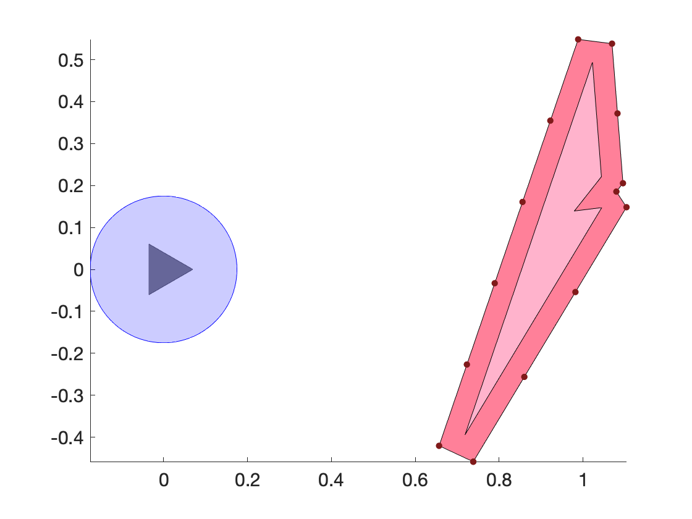
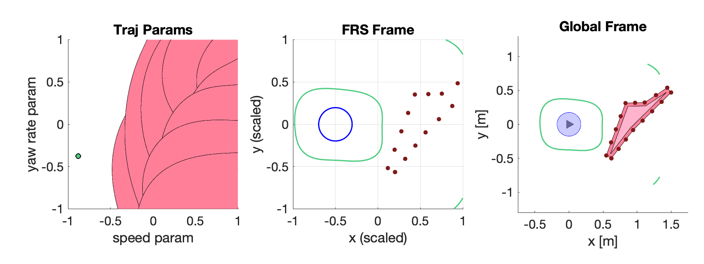
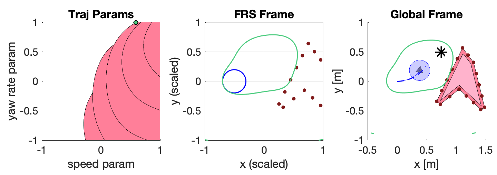

**TL;DR**: Run the script `run_turtlebot_simulation.m`.

# Step 4: Online Planning

#### [Previous step: computing the FRS](https://github.com/skousik/RTD_tutorial/tree/master/step3_FRS_computation)

Note that there is an example in the [RTD repository](https://github.com/ramvasudevan/RTD) for a Segway robot, which is really similar to the TurtleBot. Also, make sure you have the latest [RTD](https://github.com/ramvasudevan/RTD) and [simulator](https://github.com/skousik/simulator) repositories so that all the functions in this step work.

## 4.1 Summary

In this step, we use the FRS computed in the [previous step](https://github.com/skousik/RTD_tutorial/tree/master/step_3_FRS_computation) to plan trajectories for the TurtleBot online (i.e., at runtime). First, we take the entire FRS and "intersect" it with obstacles around the robot. This intersection results in all trajectory parameters that would cause a collision. Finally, we optimize over the remaining collision-free trajectory parameters. If none can be found, then we execute the fail-safe maneuver from the previous planning iteration.

### Mathy Overview

Recall that RTD uses a trajectory parameter space $K$ to specify desired trajectories. These trajectories are chosen every $t_{\mathrm{plan}}$ seconds in a receding-horizon way. Also recall that, in Step 3, we found a function $I: Z \times K \to \mathbb{R}$ for which, if $(z,k) \in \mathrm{FRS}$, then $I(z,k) \geq 1$.

Now, to pick a particular $k \in K$ at each planning iteration, given an arbitrary cost function $J: K \to \mathbb{R}$, we attempt to solve the following optimization problem:
$$
\begin{align}
k_{\text{opt}} = \mathrm{argmin}_k \{J(k)~|~I(z,k) < 1\ \forall\ z \in \mathrm{obstacles}\}
\end{align}.
$$


The good thing about this is, as we saw in the previous section, $I$ gives us a _conservative_ approximation of the FRS. So, as long as the constraint $I(z,k_{\text{opt}}) < 1$ is obeyed for all $z$ in any obstacle, then we can prove that $k^*$ is a collision-free trajectory (see [Lemma 15 on page 10 of this paper](https://arxiv.org/abs/1809.06746)).

The tricky part here is that, if an obstacle is a subset of $Z$, then probably contains infinitely many points (for example, if the obstacle is a polygon). But this means that we have to evaluate $I$ on an infinite number of points to find $k^*$. In fact, we can actually do that — check out [Section III-B here](https://arxiv.org/abs/1705.00091). However, doing this kind of evaluation is way too slow for real time planning.

To avoid this evaluation of an infinite number of points, we instead prescribe a way to discretize obstacles into a finite number of points. In other words, if $Z_{\text{obs}} \subset Z$ is an obstacle, we represent it with a set $\{z_1, z_2, \cdots, z_n\} \subset Z$.

This discretization is explained in excruciating detail in [Section 6 of this paper](https://arxiv.org/abs/1809.06746). The key takeaway is that, even though each obstacle is represented by only a finite number of points, _we keep the collision-free guarantee_ that was the whole point of computing the FRS with tracking error in the first place.

### Goals for This Step

To do online planning, we'll do the following:

1. Map obstacles to the trajectory parameter space in a single planning iteration
2. Solve a nonlinear optimization program to pick a collision-free trajectory in a single planning iteration
3. Put 1 and 2 together in a "planner" object that will run RTD online in the [simulator](https://github.com/skousik/simulator) framework


## 4.2 Mapping Obstacles to Trajectory Parameters

In this part, we will represent an obstacle in the trajectory parameter space. First, let's assume that obstacles are sensed and handed to us as **polygons**, which is reasonable for a sensor like a LIDAR. Then, we can use the discretization mentioned above in the mathy overview.

The important points of the discretization are as follows. First, we only need to discretize the obstacle's boundary, since we can't get into the obstacle without passing through the boundary. Second, we have to buffer the obstacle before discretizing, to compensate for the fact that our robot shouldn't pass between any two points of the discretized boundary. Third, we need to find a **point spacing**, denoted $r$, that tells us how finely to discretize the boundary. In other words, we want to make sure that the discrete points are spaced no farther than $r$ apart along the boundary.

The code we'll go over here is all in `example_9_map_obs_to_traj_params.m`. We'll just cover the highlights.

### Example 9

In this example, we'll make a single polygonal obstacle in front of the robot, then map it to the parameter space using the FRS polynomial $I$ that acts like an indicator function on the FRS.

First, load the FRS and create a TurtleBot. We'll use the 0.0 — 0.5 m/s FRS as in Step 3.

```matlab
FRS = load('turtlebot_FRS_deg_10_v0_0.0_to_0.5.mat') ;
A = turtlebot_agent ;
```

Recall that the robot is initially at the origin. Now, let's make a random obstacle:

```matlab
obstacle_location = [1 ; 0] ; % (x,y)
obstacle_scale = 1.0 ;
N_vertices = 5 ;
O = make_random_polygon(N_vertices,obstacle_location,obstacle_scale) ;
```

#### Example 9.1: Obstacle Buffering and Discretization

The polyline `O` represents the obstacle as a polygon. To discretize it, we first need to buffer it:

```matlab
obstacle_buffer = 0.05 ; % m
O_buf = buffer_polygon_obstacles(O,obstacle_buffer,2) ;
```

The input `2` to `buffer_polygon_obstacles` makes sure that the buffered polygon does not get any rounded edges (this is a conservative buffer method, but it'll do for this example).

Now, we can discretize just the boundary of the obstacle. First, let's set up the point spacing as per [Example 67 on pg. 35](https://arxiv.org/abs/1809.06746):

```matlab
b = obstacle_buffer ;
R = A.footprint ;
theta_1 = acos((R-b)/R) ;
r = 2*R*sin(theta_1) ;
```

Now, we discretize the obstacle:

```matlab
O_pts = interpolate_polyline_with_spacing(O_buf,r) ;
```

Let's see what this looks like:

```matlab
figure(1) ; hold on ; axis equal ;

plot(A)
patch(O_buf(1,:),O_buf(2,:),[1 0.5 0.6]) % buffered obs
patch(O(1,:),O(2,:),[1 0.7 0.8]) % actual obs
plot(O_pts(1,:),O_pts(2,:),'.','Color',[0.5 0.1 0.1],'MarkerSize',15) % discretized obs
```

You should see something like this (of course, your obstacle will be a different shape and size):



#### Example 9.2: Mapping Obstacle to FRS Frame

Recall that the FRS is computed in a scaled and shfited coordinate frame, to make sure all the trajectories stay within the $[-1,1]^2$ box. This was necessary because we computed things with polynomials that blow up to large numbers when evaluated on things greater than 1.

To use our discretized obstacle, we first have to scale, shift, and rotate it into the FRS frame:

```matlab
% get the shift and scaling
x0 = FRS.initial_x ;
y0 = FRS.initial_y ;
D = FRS.distance_scale ;

% transform the points
O_FRS = world_to_FRS(O_pts,A.state(:,end),x0,y0,D) ;
```

Note that the robot's state is passed in here as well. This is because the robot is always at 0 heading in the FRS frame. So, `world_to_FRS` first rotates all the points about the robot to 0 heading, then scales and shifts them.

Since we know our entire FRS lies within the $[-1,1]^2$ box, we can also discard any discretized obstacle points that lie outside the box:

```matlab
O_FRS = crop_points_outside_region(0,0,O_FRS,1) ;
```


#### Example 9.3: Map Discretized Obstacle to Trajectory Parameters

Now that we have our discretized obstacle, we can map it to the trajectory parameter space:

```matlab
% get FRS polynomial and variables
I = FRS.FRS_polynomial ;
k = FRS.k ;
z = FRS.z ;

% swap the speed and steer parameters for visualization purposes
I = subs(I,k,[k(2);k(1)]) ;

% evaluate FRS polynomial on obstacle points
I_k = msubs(I,z,O_FRS) ;
```


The variable `I_k` is a list of polynomials in $k$. For each of these polynomials, the 1-superlevel set contains all the trajectory parameters that could cause the TurtleBot to reach one of the discretized obstacle points. The nice part is that we can now use these `I_k` polynomials as constraints in a nonlinear optimization program over the trajectory parameters.

If you run `example_9_map_obs_to_traj_params.m`, you'll see a plot like the following:




Notice that there are artifacts near the boundaries of the $[-1,1]^2$ box where the FRS polynomial starts to blow up in the middle subplot. We can get rid of those later on by ignoring the corners of the box, since those are definitely not reachable by the robot.

## 4.3 Trajectory Optimization

Now we'll solve the online trajectory optimization problem for a single planning iteration. Much of this is the same as Example 9 above. The code is in `example_10_trajectory_optimization.m`.

### Example 10

This example turns much of the previous example into functions, then calls MATLAB's generic nonlinear optimization tool, `fmincon`, to solve the following problem:
$$
k_{\text{opt}} = \begin{array}{cll}
\underset{k \in K}{\text{argmin}} &||z(T,k) - z_\text{goal}||_2 \\
\text{s.t.} &I(z_i,k) - 1 < 0\ \forall\ z_i\ \in\ \text{discretized obstacle.}
\end{array}
$$


The point $z_\text{goal}$ is a desired location of the robot, and the point $z(T,k)$ is the endpoint of a desired trajectory parameterized by $k$. We are using $I - 1 < 0$ as the constraint to match the standard `fmincon` format for nonlinear inequality constraints.


### Example 10.1: Setup

First create the robot and load the 0.0 — 0.5 m/s FRS:

```matlab
initial_speed = 0.49 ; % m/s
FRS = load('turtlebot_FRS_deg_10_v0_0.0_to_0.5.mat') ;

A = turtlebot_agent ;
A.reset([0;0;0;initial_speed])
```

Now we'll create the desired waypoint:

```matlab
x_des = 0.75 ;
y_des = 0.5 ;
```

Also create an obstacle:

```matlab
obstacle_location = [1.1 ; 0] ; % (x,y)
obstacle_scale = 1.0 ;
N_vertices = 5 ;
obstacle_buffer = 0.05 ; % m
O = make_random_polygon(N_vertices,obstacle_location,obstacle_scale) ;
```


### Example 10.2: Creating a Cost Function

We denote the cost function $J(k) = ||z(T,k) - z_\text{goal}||_2$ . To get the point $z(T,k)$ for any $k$, we precompute the endpoint parameterized by $k$, then plug it into a cost. This is done in the script `create_turtlebot_cost_function.m`, which also computes gradients of the cost function. This script produces two functions, named `turtlebot_cost` and `turtlebot_cost_grad`.

We then format the cost and gradient for use with `fmincon` as follows. Note, **don't execute the following lines!** These lines are used in the function `turtlebot_cost_for_fmincon`:

```matlab
function [c, gc] = turtlebot_cost_for_fmincon(k,FRS,wp_local,start_tic,timeout)
    % evaluate cost and gradient
    c = turtlebot_cost(k(1),k(2),FRS.w_max,FRS.v_range(2),wp_local(1),wp_local(2)) ;
    gc = turtlebot_cost_grad(k(1),k(2),FRS.w_max,FRS.v_range(2),wp_local(1),wp_local(2)) ;

    % perform timeout check
    if nargin > 3 && toc(start_tic) > timeout
        error('Timed out while evaluating cost function!')
    end
end
```


We pass this to `fmincon` in the example script as follows (run these lines):

```matlab
% create waypoint from desired location
z_goal = [x_des; y_des] ;

% transform waypoint to FRS coordinates
z_goal_local = FRS_to_world(z_goal,A.state(:,end),FRS.initial_x,FRS.initial_y,FRS.distance_scale) ;

% use waypoint to make cost function
cost = @(k) turtlebot_cost_for_fmincon(k,FRS,z_goal_local) ;
```


### Example 10.3: Creating the Constraints

Now we'll do the same obstacle discretization and evaluation of the FRS polynomial as in Example 9 above. Here, we've wrapped up much of the code into handy-dandy functions. First, discretize the obstacle:

```matlab
point_spacing = compute_turtlebot_point_spacings(A.footprint,obstacle_buffer) ;
[O_FRS, O_buf, O_pts] = compute_turtlebot_discretized_obs(O,...
                    A.state(:,end),obstacle_buffer,point_spacing,FRS) ;
```


Now, we'll break the FRS polynomial into a simpler representation than the `msspoly` that we were using above. This is because, for online planning, we need to compute the constraints faster than the spotless function `msubs` can operate. Also note that `fmincon` treats constraints as feasible when they are negative, hence the use of $I - 1$ as noted above.

```matlab
% get FRS polynomial and variables
FRS_msspoly = FRS.FRS_polynomial - 1 ; % the -1 is really important!
k = FRS.k ;
z = FRS.z ;

% decompose polynomial into simplified structure (this speeds up the
% evaluation of the polynomial on obstacle points)
FRS_poly = get_FRS_polynomial_structure(FRS_msspoly,z,k) ;
```

This decomposition just turns the FRS polynomial into a matrix of powers and a matrix of coefficients. Then, polynomial evaluation just requires matrix operations that can run super fast.

Now we can create the nonlinear constraint function. Note that this uses some functions in the RTD repository that take advantage of the decomposed polynomial. Take a look in `turtlebot_nonlcon_for_fmincon.m` for more details.

```matlab
% swap the speed and steer parameters for visualization purposes
FRS_poly_viz = subs(FRS_msspoly,k,[k(2);k(1)]) ;

% evaluate the FRS polynomial structure input on the obstacle points to get
% the list of constraint polynomials
cons_poly = evaluate_FRS_polynomial_on_obstacle_points(FRS_poly,O_FRS) ;

% get the gradient of the constraint polynomials
cons_poly_grad = get_constraint_polynomial_gradient(cons_poly) ;

% create nonlinear constraint function for fmincon
nonlcon = @(k) turtlebot_nonlcon_for_fmincon(k,cons_poly,cons_poly_grad) ;
```


This gives us the nonlinear constraints. We also need to bound the space $K$. Recall that $K = [-1,1]^2$. However, we also chose a limit that $|v_{\text{des}} - v_0| < 0.25$ m/s, which we need to enforce in terms of upper and lower bounds on $k$. We do this as follows:

```matlab
% create bounds for yaw rate
k_1_bounds = [-1,1] ;

% create bounds for speed
v_0 = initial_speed ;
v_max = FRS.v_range(2) ;
v_des_lo = max(v_0 - FRS.delta_v, FRS.v_range(1)) ;
v_des_hi = min(v_0 + FRS.delta_v, FRS.v_range(2)) ;
k_2_lo = (v_des_lo - v_max/2)*(2/v_max) ;
k_2_hi = (v_des_hi - v_max/2)*(2/v_max) ;
k_2_bounds = [k_2_lo, k_2_hi] ;

% combine bounds
k_bounds = [k_1_bounds ; k_2_bounds] ;
```


### Example 10.4: Trajectory Optimization

Now we can call `fmincon`! Note that we've chosen these options to help `fmincon` solve faster. You can read more about these [here](https://www.mathworks.com/help/optim/ug/fmincon.html).

```matlab
% create initial guess
initial_guess = zeros(2,1) ;

% create optimization options
options =  optimoptions('fmincon' 'MaxFunctionEvaluations',1e5,'MaxIterations',1e5,...
                'OptimalityTolerance',1e-3','CheckGradients',false,...
                'FiniteDifferenceType','central','Diagnostics','off',...
                'SpecifyConstraintGradient',true,...
                'SpecifyObjectiveGradient',true);

% call fmincon
[k_opt,~,exitflag] = fmincon(cost,...
                            initial_guess,...
                            [],[],... % linear inequality constraints
                            [],[],... % linear equality constraints
                            k_bounds(:,1),... % lower bounds
                            k_bounds(:,2),... % upper bounds
                            nonlcon,...
                            options) ;
                        
% check the exitflag
if exitflag < 0
    k_opt = [] ;
end
```

Depending on the random obstacle, the problem will either be feasible or not. In the case that it is, we can now use all the plotting stuff from Example 9 and see what things look like. You'll see something like this:



Now that we can do a single planning iteration, we can wrap everything up to run in the loop for online planning.

## 4.4 Running a Simulation

You can run a simulation with `run_turtlebot_simulation.m`. We'll briefly walk through the code here. More details on the simulator framework are in the tutorial [extras](https://github.com/skousik/RTD_tutorial/tree/master/step_5_extras/extra_2_writing_an_RTD_planner).

We have wrapped up the trajectory optimization procedure above in a `planner` class that inherits the generic RTD planner class as follows (don't run this line):

```matlab
turtlebot_RTD_planner_static_subclass < generic_RTD_planner
```


There's a lot going on in this class, but the gist is that its `replan` method gets called at every planning iteration to attempt trajectory optimization. Let's set up a simulation to see this working. First, the setup:

```matlab
% world
obstacle_size_bounds = [0.2, 0.3] ; % side length [min, max]
N_obstacles = 7 ;
bounds = [-4,4,-2,2] ;
goal_radius = 0.5 ;

% planner
buffer = 0.05 ; % m
t_plan = 0.5 ; % if t_plan = t_move, then real time planning is enforced
t_move = 0.5 ;

% simulation
verbose_level = 10 ;
```

Now, create the agent, world, and planner:

```matlab
A = turtlebot_agent ;

P = turtlebot_RTD_planner_static_subclass('verbose',verbose_level,'buffer',buffer,...
                                 't_plan',t_plan,'t_move',t_move) ;

W = static_box_world('bounds',bounds,'N_obstacles',N_obstacles,'buffer',0.25,...
                     'verbose',verbose_level,'goal_radius',goal_radius,...
                     'obstacle_size_bounds',obstacle_size_bounds) ;
```

Finally, create the simulator, and run a simulation:

```matlab
S = simulator(A,W,P,'allow_replan_errors',true,'verbose',verbose_level,...
              'max_sim_time',30,'max_sim_iterations',60) ;
              
S.run ;
```

You should see the TurtleBot move around in a box-shaped world with randomly-placed box obstacles. It will try to reach the goal in the green circle.

Note that this sets the `allow_replan_errors` property to `true` for the simulator. In other words, if the planner errors, the simulation will come screeching to a halt with an error. This is super useful for debugging, but should be set to `false` for, e.g., running hundreds of simulations.

There's a _lot_ going on behind the scenes in the simulator. Explanatory details are in the [extras](https://github.com/skousik/RTD_tutorial/tree/master/step_5_extras/extra_1_simulator_overview). The gist of the simulation loop is as follows, in pseudocode:

```C++
planner.old_plan <-- "agent stays stopped" // initialize old plan

while agent not at goal or crashed
    agent_info <-- agent.get_info() // info such as the current state
    world_info <-- world.get_info(agent_info) // info such as obstacles

    try // try to find a new plan with trajectory optimization as above
        new_plan <-- planner.replan(agent_info,world_info,planning_timeout)
        planner.old_plan <- new_plan
    catch // the planner errors if it can't plan within the timeout
        new_plan <-- planner.old_plan
    end

agent.move(new_plan)
end
```


That ends this tutorial about Reachability-based Trajectory Design. Thanks for reading!

##### [**Go back to tutorial home page**](https://github.com/skousik/RTD_tutorial).

##### [Learn how to write an RTD planner in excruciating detail](https://github.com/skousik/RTD_tutorial/tree/master/step_5_extras/extra_2_writing_an_RTD_planner)

$.$